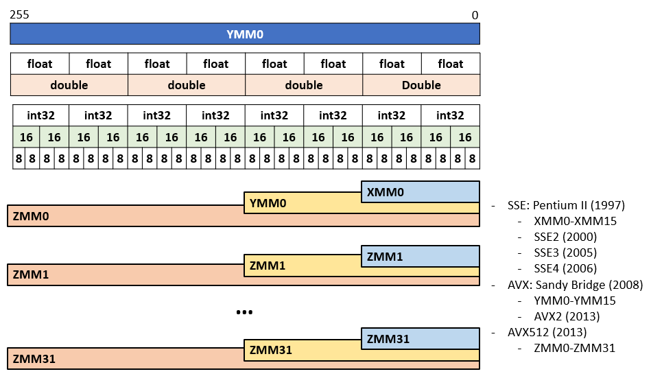

# Intrinsic programming


## 1. SIMD

```{admonition} Overview
:class: dropdown

- Modern CPUs rely on parallelism to improve performance
  - Task parallelism: multicores and hyperthreadings
  - Instruction paralellism: mutliple instructions are executed concurrently 
  by a single CPU. 
- Older CPUs (Pentium)
  - Instructions are executed via a pipeline fashion
- Recent CPUs
  - Vector operations
  - Instructions operate on 4 to 8 inputs, yielding 4 or 8 results in a single clock cycle
  - Single Instruction, Multiple Data

```

```{admonition} SIMD concepts
:class: dropdown

- CPU uses registers to store data to operate on
- Basic registers: 
  - 32-bit and 64-bit
  - Each register holds a single scalar value
- Vector registers:
  - Stores 4 (SSE) or 8 (AVX) scalar values. 
  - An instruction can be applied on an entire vector register. 

```

```{admonition} SSE and AVX
:class: dropdown

- SSE: Streaming SIMD Extensions
  - Single instruction, multiple data (SIMD instruction set)
- Advanced Vector Extensions SIMD



```

## 2. SIMD in practice

```{admonition} Key concept
:class: dropdown

- Adjacent values in memory that can be operated in parallel. 

```

```{admonition} Loop unrolling
:class: dropdown

- Recalling CSC 231: Data locality

~~~c
for (int i = 0; i < 1000; i++)
  x[i] = x[i] + s;
~~~

- Given the cache size, successive instructions can be carried out 
without significant cache misses

~~~c
for (int i = 0; i < 996; i=i-4) {
  x[i] = x[i] + s;
  x[i+1] = x[i+1] + s;
  x[i+2] = x[i+2] + s;
  x[i+3] = x[i+3] + s;
}

```

```{admonition} Intel SSE Instrinsics
:class: dropdown

- The instructions in the unrolled loop can be packed into 
SSE/AVX registers so that they can be carried out in parallel. 

```

## 3. Hands-on

```{admonition} Unrolled loop
:class: dropdown

<script src="https://gist.github.com/linhbngo/05955842d2a7ce40c9723292a2ded118.js?file=unrolled.c"></script>

```

```{admonition} SSE example 1
:class: dropdown

- [__m128](https://www.intel.com/content/www/us/en/develop/documentation/cpp-compiler-developer-guide-and-reference/top/compiler-reference/intrinsics/details-about-intrinsics.html): Represents the contents of a SSE register used by the Intel Streaming SIMD. 
- [__mm_loadu_ps](https://www.intel.com/content/www/us/en/develop/documentation/cpp-compiler-developer-guide-and-reference/top/compiler-reference/intrinsics/intrinsics-for-sse/load-intrinsics-2.html): Loads four SP FP values in reverse order. The address `p` need not be 
16-byte aligned. 
- [__mm_set1_ps](https://www.intel.com/content/www/us/en/develop/documentation/cpp-compiler-developer-guide-and-reference/top/compiler-reference/intrinsics/intrinsics-for-sse/set-intrinsics-2.html): Sets four SP FP values to `w`. 
- [__mm_mul_ps](https://www.intel.com/content/www/us/en/develop/documentation/cpp-compiler-developer-guide-and-reference/top/compiler-reference/intrinsics/intrinsics-for-sse/arithmetic-intrinsics-2.html): Multiply fource single-precision FP values of `a` and `b`. 

<script src="https://gist.github.com/linhbngo/05955842d2a7ce40c9723292a2ded118.js?file=unroll_sse.c"></script>

```

```{admonition} SSE example 2
:class: dropdown

<script src="https://gist.github.com/linhbngo/05955842d2a7ce40c9723292a2ded118.js?file=unroll_sse_2.c"></script>

```

```{admonition} Challenge: Loop unrolling
:class: dropdown

Modify the below source code with the followings:
- Add another function to carry out matrix multiplication with the two
inner loops unrolled. 
- In the main function, create another matrix variable 
called **unrolled_result[2][2]**. Call the new function and the 
**display** function on this variable 
and confirm that you have the same results. 

<script src="https://gist.github.com/linhbngo/05955842d2a7ce40c9723292a2ded118.js?file=matrix.c"></script>


```

```{admonition} Challenge: SSE
:class: dropdown

Continue modifying the source code from the above challenge as followed:
- Add yet another function to carry out matrix multiplication. This function 
should be based on the previous unrolled multiplication and utilize intrinsic 
programming to carry out multiple integer operations at the same time. 
- In the main function, create another matrix variable 
called **sse_result[2][2]**. Call the new function and the 
**display** function on this variable 
and confirm that you have the same results. 

```


```{admonition} Challenge: Scaling up and SSE
:class: dropdown

Continue modifying the source code from the above challenge as followed:
- Modify so that the program multiplies two 8x8 matrices. 
- Reimplement the unrolling/intrinsic multiplication: 
  - **Palmetto** has different phases with different CPU generations, supporting from 
  sse up to avx512. 
  - Provide implementations for sse/avx/avx512, and confirm that it works on different 
  Palmetto allocation request.  
- Call the new function and the **display** function on this variable 
and confirm that you have the same results. 

```
